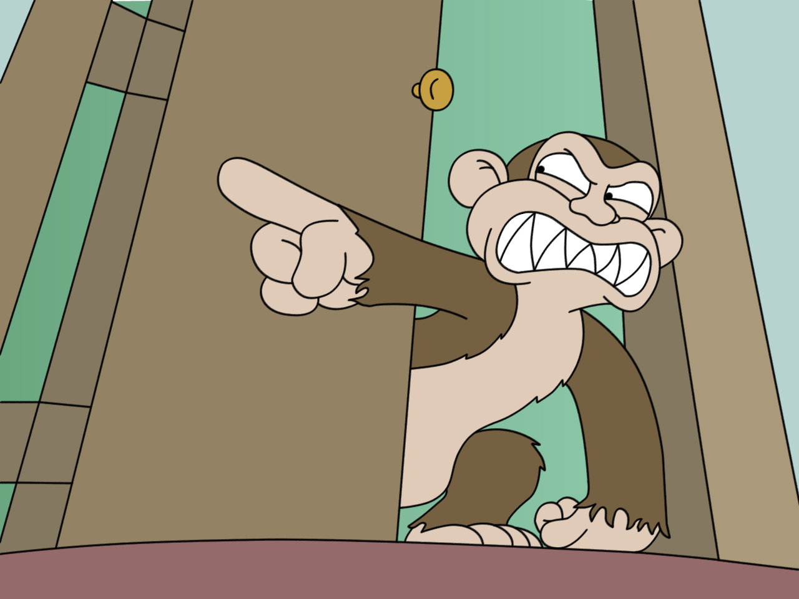

A Rubocop extension containing two cops:

1. [Model Structure](docs/model_structure.md). Keep those "macro" methods at the top
   of your model files clean and consistent across the project.

2. [Migration Constants](docs/migration_constants.md). Prevent a common source of
   migration breakage - dependencies on things that are likely to change by the
   time the migration is actually run.

## Installation

Add this line to your application's Gemfile:

```ruby
gem 'dark_finger'
```

And then execute:

    $ bundle

Or install it yourself as:

    $ gem install dark_finger

## Usage

See the guides for each of the Cops for details.

## License

The gem is available as open source under the terms of the [MIT License](http://opensource.org/licenses/MIT).

